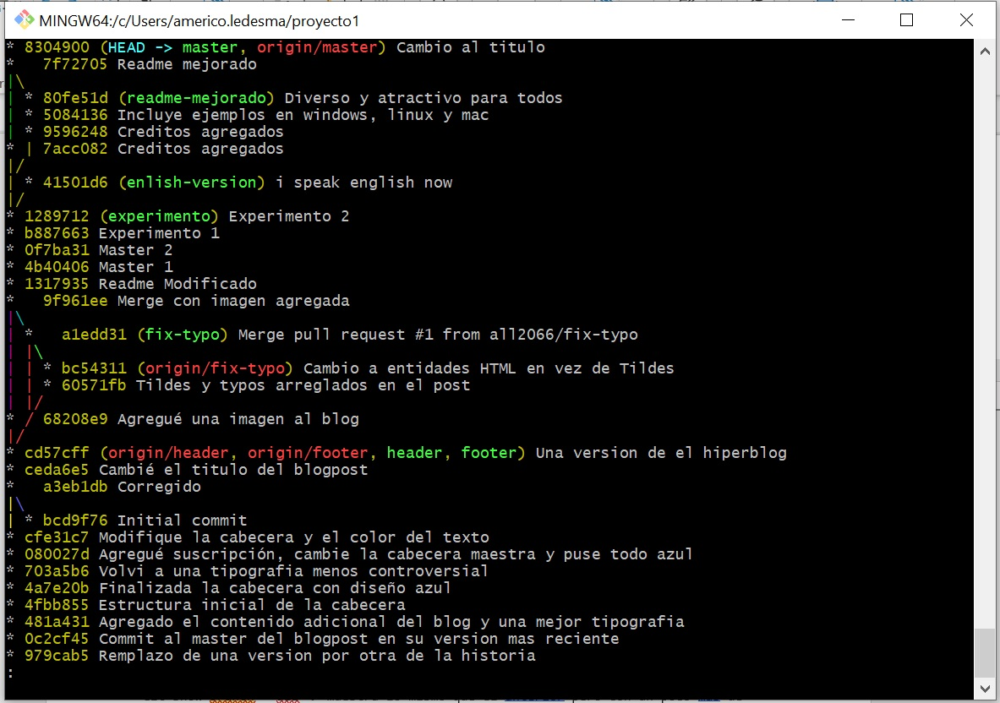
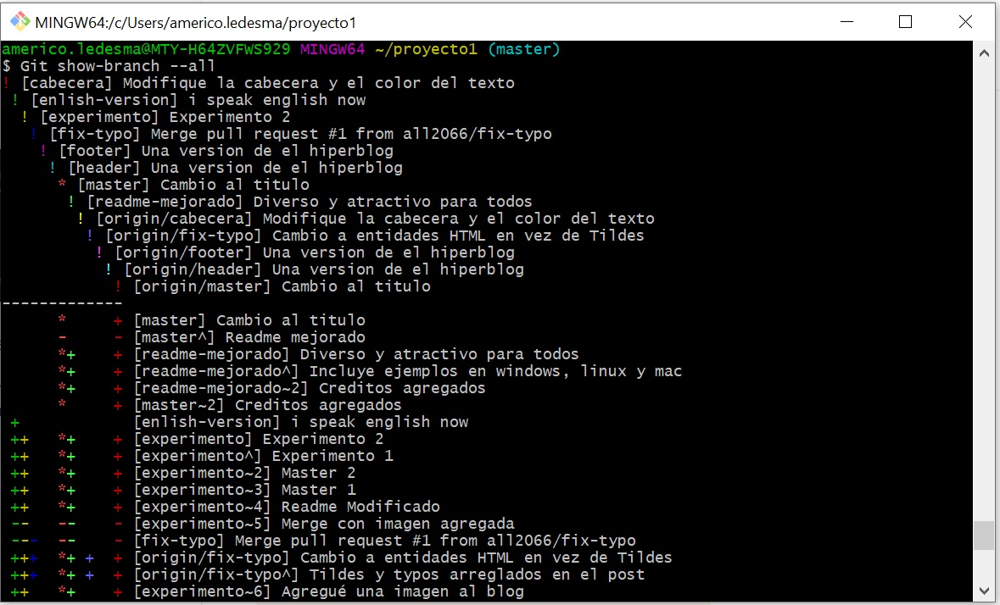
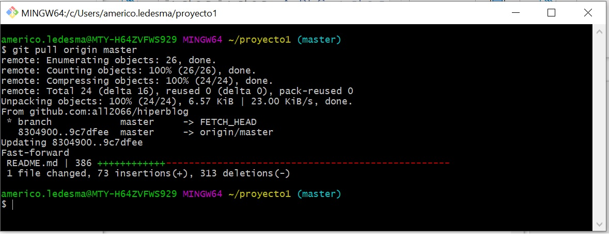
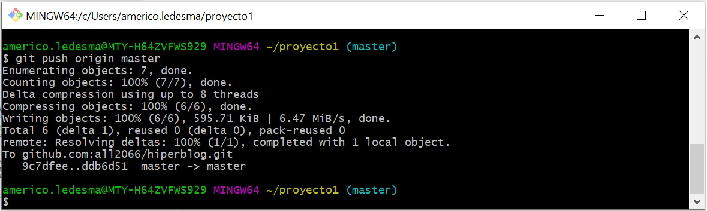

# Git and Github Course

### Table of contents
* [Introduction](#introduction) 
* [Technologies](#technologies)
* [Commands](#commands)
* [Syntax](#syntax)
* [Examples](#examples)
* [Source](#source)


### Introduction
Git is software for tracking changes in any set of files. We can know all the history of changes in our project.
In this course we practice with commands to the correct use of Git, and also to manage a remote repository using Github.

In addition, we learned so much about the archive README.md and the guidelines that must be met.
Include the following elements:
* Titles and internal titles
* Introduction - the project's aim
* Technologies
* Launch

Consider additional elements such as: 
* Table of contents
* Illustrations
* Scope of functionalities 
* Examples of use
* Project status 
* Sources
* Other information

### Technologies
* HTML
* CSS
* Git
* GitHub

### Commands
| Function name | Description                    |
| ------------- | ------------------------------ |
| `git clone url`      | This command saves the directory as the default directory name of the git repository       |
| `git checkout branch_name`   |  Reach to the target branch    | 
| `git merge new_branch`   | Merge the branch to target branch    | 
| `git commit --amend`   |  When there is a situation when you forget to add some files to commit and want to undo any commit     | 
| `git branch`   |  List all of the branches in your repository     | 
| `git branch branch_name`   |  Create a new branch    | 
| `git branch -d branch_name`   |  Delete the specific branch     | 


### Syntax
Set your username:
```
git config --global user.name "FIRST_NAME LAST_NAME"
```
Set your email address:
```
git config --global user.email "MY_NAME@example.com"
```

#### Push files to your Git repository
* Step 1: Go to Github repository and in code section copy the URL.
* Step 2: In the Command prompt, add the URL for your repository where your local repository will be pushed.
```
git remote add origin repository_URL
```
* Step 3: Push the changes in your local repository to GitHub.
```
git push origin master
```
Now in the GitHub repository, the pushed files can be seen.


### Examples

```
git log --all --graph --decorate --oneline   
```
This shows each commit on one line, decorates each line with any information about branches and repos and displays a graph where commits have branched or merged.

******************************
```
Git show-branch --all
```
Lists all the branches from the local repository, both the local and the remote tracking branches.

******************************
```
git pull origin master
```
Downloads new changes from the branch named master on the remote named origin and integrates them into your local HEAD branch

******************************
```
git push origin master
```
Push the commits in the local branch named master to the remote named origin



### Source:
How to Write a Good Readme                   
https://bulldogjob.com/news/449-how-to-write-a-good-readme-for-your-github-project                   

